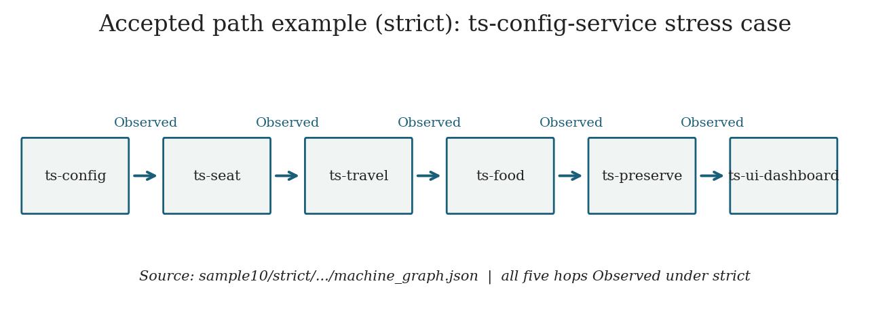
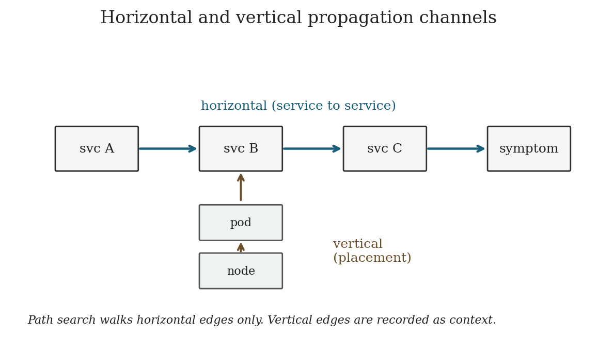
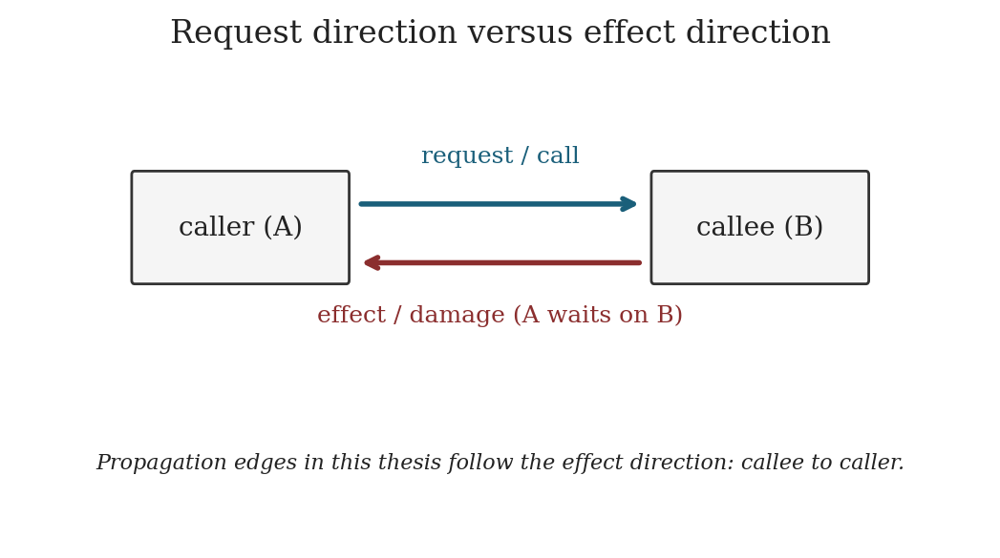
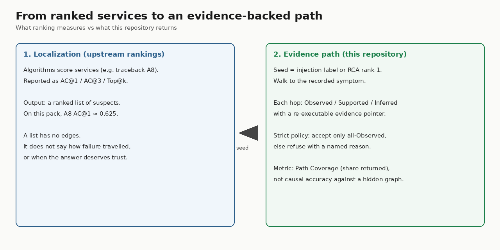
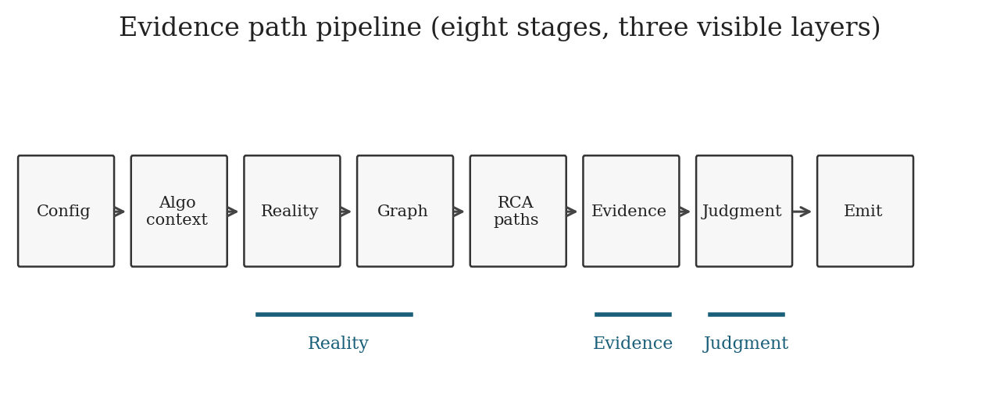

# Failure propagation paths

This repository is the public code and result pack for an MSc thesis (Alexis Marin, SRH Berlin, 2026).

**What the method does.** In a cloud native microservice failure, it builds a candidate path from a seed service to a symptom service. Every hop is labelled Observed, Supported, or Inferred, with a pointer back to the telemetry that supports the label. If the evidence is too weak for the chosen acceptance policy, it returns refuse and names the reason (for example weak hops, or no connected route). That refusal is a valid output, not a crash.

**What you will find here**

| Path | What it is |
|---|---|
| `analysis/cli.py` | CLI entry for one case or a sample list |
| `analysis/pipeline/` | Reality → graph → evidence → judgment → emit |
| `analysis/samples/` | Case id lists (`sample10`, `sample100`, `sample_all`) |
| `rankings/` | Upstream RCA rankings (44 MB) so the RCA seed is reproducible |
| `tests/` | Unit and integration tests |
| `results/evidence_path_poc/sample_all/` | Frozen outputs for 1422 benchmark cases (`strict/` and `relaxed/`; open `index.html`) |
| `results/evidence_path_poc/sample10/` | Small subset for a quick look |
| `docs/REPRODUCE.md` | Install, browse results, datapack, re run a case |
| `scripts/validate.sh` | Checks that the tree is complete and tests pass |

**What is not here.** The ~13 GB RCABench telemetry pack. Download it from Zenodo ([DOI 10.5281/zenodo.17105974](https://doi.org/10.5281/zenodo.17105974), CC BY 4.0). Everything else needed to recompute a case is in this repository, including the upstream rankings that provide the RCA seed.


## What this looks like

Three views of the method. Full size images live under [`docs/figures/`](docs/figures/).

### 1. Full evidence path (chain)

A candidate route from seed to symptom. Every hop is labelled with evidence, or the case is refused.



### 2. Horizontal vs vertical edges

Path search walks **horizontal** service-to-service edges. **Vertical** edges are placement context (pod, container, node), not hops on the returned path. Request direction and effect direction can disagree on call edges.





### 3. Ranking metrics vs path judgment

Upstream RCA algorithms produce a ranked list (AC@1 / Top@k). This repository takes a seed (injection or RCA rank-1), builds a path, and returns either a graded route or an explicit refuse. The headline metric here is Path Coverage, not causal accuracy against a hidden graph.



Pipeline overview:




**Run**

```bash
git clone https://github.com/PlastiData/msc-thesis-propagation-path.git
cd msc-thesis-propagation-path
python -m venv .venv && .venv/bin/pip install -e ".[dev]"
.venv/bin/python -m pytest tests/ -q
python3 -m http.server 8765 -d results/evidence_path_poc/sample_all/strict
```

Open http://127.0.0.1:8765/ for the case queue. License: [CC BY 4.0](LICENSE).
